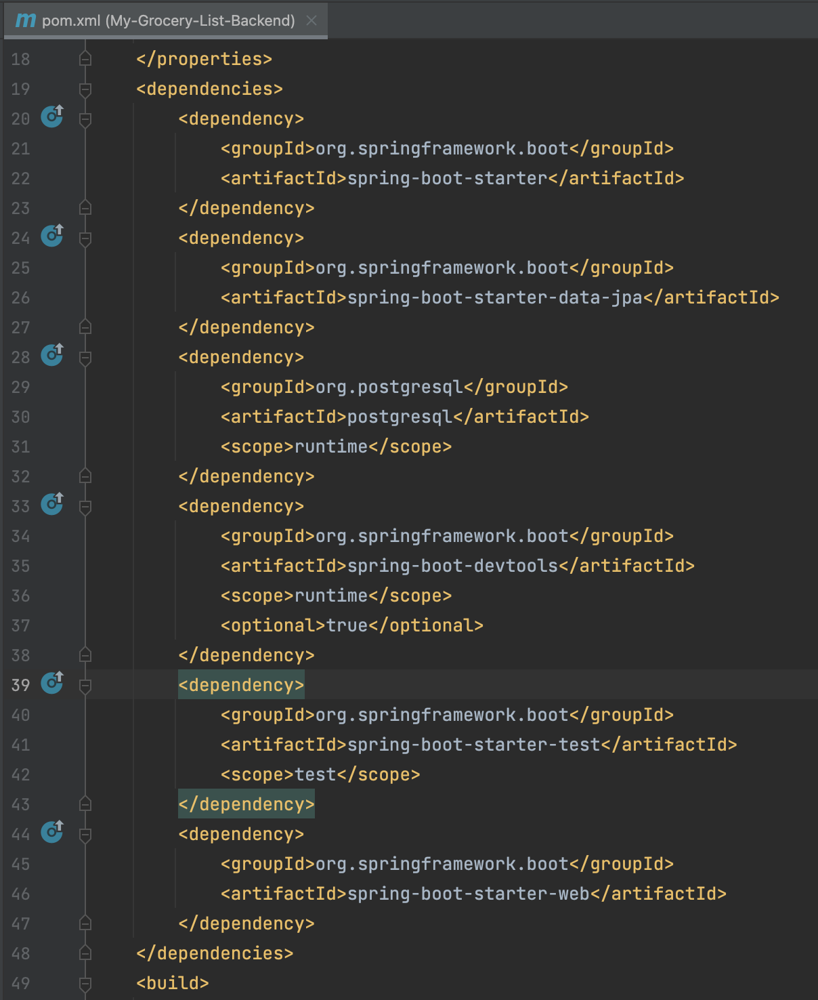
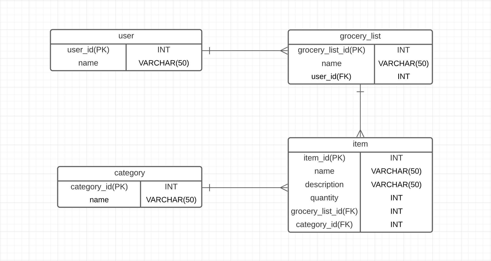

# My-Grocery-List-Backend
## Purpose of this application
This application is designed to manage grocery lists. The user should be able to create new lists and manage those lists by adding or deleting items according to purchases needs. The user should be able to view a full list of groceries and categorized each item for better list organization.
This project involves using a REST API for a grocery list database that allows the user to view a full list of groceries.

The project is built using the Model View Controller design (MVC), following the principle of "separation of concerns" allowing the application to communicate for data logic and data access.

When the user sends an API request in Postman the Controller receives it, comunicates it to the Service which interacts with the Java Persistence API (JPA) to store, update and retrieve data in a PostgreSQL relational database.

This project consists of:
* 4 Model Classes
* 4 Controller Classes
* 4 Service Classes
* 4 Repository Interfaces
* 12 API endpoints, all made public.

#### System Tools Used
* Spring Boot
* IntelliJ IDEA
* Java
* Maven
* Lucidchart
* PostgreSQL
* Postman

#### Installation & Dependencies
* Create a PostgreSQL database
* Configure the application-dev.properties including server, spring jpa and spring datasource information
* The project must have the following dependencies inside the pom.xml file:



## My Grocery List App User Stories

As a person I want to be able to manage my grocery purchases using an application
* Given that I want to use an application to manage my groceries
* When I start the application it will ask me for a user name
* Then my name will be recorded in the database as a new user

As a user I want to be able to create a new grocery list.
* Given that I want to create a grocery list
* When I type the new grocery list and send the request to the server
* Then the grocery list is saved in the database and I will see it on my device

As a user I want to be able to create a new item on my grocery list.
* Given that I have an existing grocery list and that I want to create a new item
* When I type the new item on my grocery list and send the request to the server
* Then the item is saved in the database and I will see it on my grocery list

As a user I want to be able to organize items by category on my grocery list.
* Given that I have an existing grocery list and while creating an item
* When I select a category for that item on my grocery list and send the request to the server
* Then the item is saved in the selected category and I will see it on my grocery list

As a user I want to be able to delete an item already purchased.
* Given that I have an existing grocery list
* When I want to delete an item on my grocery list and send the request to the server
* Then the deleted item is removed from the database and I will not see it on my grocery list anymore

As a user I want to be able to see all of my grocery list information.
* Given that I have an existing grocery list
* When I request the grocery list from the server
* Then all the items in the grocery list will be display

As a user I want to be able to delete a grocery list no longer wanted.
* Given that I have an existing grocery list
* When I want to delete that grocery list and send the request to the server
* Then the deleted grocery list is removed from the database and I will not see it on my device anymore

As a user I want to be able to keep as many grocery lists as I want.


## Entity Relationship Diagram (ERD)


### Endpoints for User
| Request Type | URL                | Functionality | Request Body |
|--------------|--------------------|---------------|--------------|
| GET          | /api/user          | Get all users | None         |
| POST         | /api/user/         | Create a user | User object  |
| GET          | /api/user/{userId} | Get a user    | None         ||
| DELETE       | /api/user/{userId} | Delete a user | None         |

### Endpoints for GroceryList
| Request Type | URL                                            | Functionality            | Request Body       |
|--------------|------------------------------------------------|--------------------------|--------------------|
| GET          | /api/user/{userId}/groceryList                 | Get all grocery lists    | None               |
| POST         | /api/user/{userId}/groceryList                 | Create a grocery list    | GroceryList object |
| GET          | /api/user/{userId}/groceryList/{groceryListId} | Get a grocery list by Id | None               |
| DELETE       | /api/user/{userId}/groceryList/{groceryListId} | Delete a grocery list    | None               |

### Endpoints for Item
| Request Type | URL                                                                  | Functionality       | Request Body |
|--------------|----------------------------------------------------------------------|---------------------|--------------|
| POST         | /api/user/{userId}/groceryList/{groceryListId}/category/{categoryId} | Create an item      | Item object  |
| GET          | /api/user/{userId}/groceryList/{groceryListId}/item/{itemId}         | Get an item by Id   | None         |
| DELETE       | /api/user/{userId}/groceryList/{groceryListId}/item/{itemId}         | Delete an item      | None         |

### Endpoints for Category
| Request Type | URL           | Functionality      | Request Body |
|--------------|---------------|--------------------|--------------|
| GET          | /api/category | Get all categories | None         |

## Sample of data
```
[
  {
    "userId": 1,
    "name": "Tatiana",
    "groceryLists": [
        {
            "groceryListId": 7,
            "name": "Cake",
            "items": [
                {
                    "itemId": 81,
                    "name": "Sprinkles",
                    "description": "Blue",
                    "quantity": 1,
                    "category": {
                        "categoryId": 5,
                        "name": "Condiments, Spices & Baking"
                    }
                },
                {
                    "itemId": 26,
                    "name": "Milk",
                    "description": "Galon",
                    "quantity": 1,
                    "category": {
                        "categoryId": 6,
                        "name": "Dairy, Eggs & Cheese"
                    }
                },
                {
                    "itemId": 25,
                    "name": "Eggs",
                    "description": "Organic",
                    "quantity": 12,
                    "category": {
                        "categoryId": 6,
                        "name": "Dairy, Eggs & Cheese"
                    }
                }
            ]
        },
        {
            "groceryListId": 12,
            "name": "Brunch",
            "items": [
                {
                    "itemId": 39,
                    "name": "Strawberries ",
                    "description": "Organic",
                    "quantity": 1,
                    "category": {
                        "categoryId": 1,
                        "name": "Produce"
                    }
                },
                {
                    "itemId": 83,
                    "name": "Orange Juice",
                    "description": "Tropicana",
                    "quantity": 1,
                    "category": {
                        "categoryId": 2,
                        "name": "Beverages"
                    }
                },
                {
                    "itemId": 34,
                    "name": "Croissants",
                    "description": "With almonds",
                    "quantity": 12,
                    "category": {
                        "categoryId": 3,
                        "name": "Bread & Bakery"
                    }
                },
                {
                    "itemId": 82,
                    "name": "Flowers",
                    "description": "Pink tulips",
                    "quantity": 1,
                    "category": {
                        "categoryId": 14,
                        "name": "Other"
                    }
                }
            ]
        }
    ]
  }
]
```
